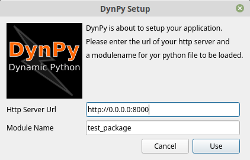

# DynPy

DynPy is an application loader that dynamically loads python and QML files over the internet and executes them.  
The fun part is, that DynPy is shipped with Qt5, PyQT5 and a few other modules so that it's possible to create GUI applications without the need to recompile and package them.   

If you ever had packaged a Python app for Android or iOS you know what I mean.

## Target Platforms  
DynPy is able to run on all major platforms (Windows, Mac OS, Linux, Android and iOS).

## Possible Scenarios
### Intranet Application
You are deploying an app on the intranet which is still under development. You are able to deploy program changes on the fly. Just copy the newer version (Python and QML) on your webserver and when the users are starting the app the next time they have got the latest version.

### Development Phase
You're app is in the development phase and you don't want to recompile a new version for mobile for testing small changes. You can just edit the source files while `python3 -m http.server` is running and when re-starting the app your new version is running on your mobile. Without compiling or packaging.

### Staging
While the app is still in test phase it can be rolled out very quickly by just switching ip's from staging to production web server.

## Motivation
Currently I am writing a book about Python and PyQt5 and I am struggling to get a demo app to compile and package for Android. That's why I had the idea to build this app. So now I don't have to build this app again and again just to see if my code is running well on my mobile. And this is also true for the readers of my book. This app is also for them.  
The other point is that I have worked for banks a couple of years and there it took weeks to get a new version of a desktop app to be shipped. Even emergency bugfixes took days to roll out. There still was the idea to build all these bank apps as web applications, but...  
...the only good thing about web apps is that they can be deployed to millions of customers in seconds.